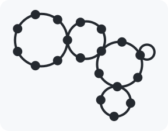

<picture>
  <source
    media="(prefers-color-scheme: dark)"
    srcset="./docs/img/multiring-github-dark.png"
  >
  <source
    media="(prefers-color-scheme: light)"
    srcset="./docs/img/multiring-github-light.png"
  >
  
</picture>

# multiring.zig

The *multiring* is a singly [linked][linked list], cyclic and [hierarchical][tree] [abstract data type] that supports forward traversal. multiring.zig implements the mulitiring in the [Zig language][Zig].

> ⚠ The multiring, as implemented in this repository, hasn’t been specified and verified formally.

The following animation shows how a multiring is traversed. The colored spheres represent gate (sentinel) nodes that control the traversal of the data nodes.

<p align="center">
  <picture>
    <source
      media="(prefers-color-scheme: dark)"
      srcset="./docs/img/multiring-traversal-github-dark.gif"
    >
    <source
      media="(prefers-color-scheme: light)"
      srcset="./docs/img/multiring-traversal-github-light.gif"
    >
    
  </picture>
</p>

The counter-clockwise orientation of traversal is arbitrary—we obtain it by having the normal to the plane of each ring point up and applying the [right-hand rule]. We chose a 3D representation to better visualize the depth of the traversal.

## Importing multiring.zig

Begin by placing the *multiring.zig* file into your Zig project. You may achieve this using [`git submodule`][submodules], e.g.,

```console
mkdir deps
git submodule add https://github.com/ok-ryoko/multiring.zig deps/multiring.zig
```

Alternatively, you may clone the repository elsewhere and use a tool of your choice, e.g., [rsync], to copy the *multiring.zig* file directly to your project. This strategy is more space-efficient but requires you to manage updates to multiring.zig manually.

In your *build.zig* file, add the following line (assuming you’re building an executable):

```zig
exe.addPackagePath("multiring", "path/to/multiring.zig");
```

… where `exe` is a `std.build.LibExeObjStep`. You should now be able to import multiring.zig like so:

```zig
const multiring = @import("multiring");
const MultiRing = multiring.MultiRing;
const MultiRingError = multiring.MultiRingError;
```

## Using multiring.zig

Please see the integration test in [*multiring.zig*][source].

The `MultiRing` API is still unstable; [Ryoko] doesn’t recommend using this library in production.

## Applications

multiring.zig has no known applications. Ryoko wrote it to practice Zig, have fun and show linked lists some love. If you have used multiring.zig successfully in your project(s), please let us know by [starting a discussion][discussions].

## Community

### Understanding our code of conduct

Please take time to read [our code of conduct][code of conduct] before reaching out for support or making a contribution.

### Getting support

If you’re encountering unexpected or undesirable program behavior, check the [issue tracker] to see whether your problem has already been reported. If not, please consider taking time to create a bug report.

If you have questions about using the program or participating in the community around the program, consider [starting a discussion][discussions].

Please allow up to 1 week for a maintainer to reply to an issue or a discussion.

### Contributing to multiring.zig

If you’re interested in contributing, then please read [our contributing guidelines][contributing guidelines].

## License

multiring.zig is free and open source software [licensed under the MIT license][license].

## Acknowledgements

The implementation is inspired by the implementation of [`std.SinglyLinkedList`][std.SinglyLinkedList] in Zig 0.9.1.

The following resources have been instrumental in preparing this repository for community contributions:

- [Open Source Guides]
- [the GitHub documentation][GitHub documentation] and [the github/docs repository][github/docs]
- [the tokio contributing guidelines][tokio contributing guidelines]

[abstract data type]: https://en.wikipedia.org/wiki/Abstract_data_type
[code of conduct]: ./CODE_OF_CONDUCT.md
[contributing guidelines]: ./CONTRIBUTING.md
[discussions]: https://github.com/ok-ryoko/multiring.zig/discussions
[GitHub documentation]: https://docs.github.com/en
[github/docs]: https://github.com/github/docs
[issue tracker]: https://github.com/ok-ryoko/multiring.zig/issues
[license]: ./LICENSE.txt
[linked list]: https://en.wikipedia.org/wiki/Linked_list
[Open Source Guides]: https://opensource.guide/
[right-hand rule]: https://en.wikipedia.org/wiki/Right-hand_rule
[rsync]: https://rsync.samba.org/
[Ryoko]: https://github.com/ok-ryoko
[source]: ./src/multiring.zig
[std.SinglyLinkedList]: https://github.com/ziglang/zig/blob/0.9.1/lib/std/linked_list.zig
[submodules]: https://git-scm.com/book/en/v2/Git-Tools-Submodules
[tokio contributing guidelines]: https://github.com/tokio-rs/tokio/blob/d7d5d05333f7970c2d75bfb20371450b5ad838d7/CONTRIBUTING.md
[tree]: https://en.wikipedia.org/wiki/Tree_(data_structure)
[Zig]: https://ziglang.org/
