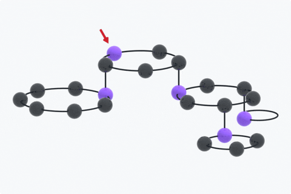

<picture>
  <source
    media="(prefers-color-scheme: dark)"
    srcset="./docs/img/multiring-github-dark.png"
  >
  <source
    media="(prefers-color-scheme: light)"
    srcset="./docs/img/multiring-github-light.png"
  >
  
</picture>

# multiring.zig

The *multiring* is a [hierarchical][tree], [forwardly linked][linked list] and circularly linked [abstract data type]. multiring.zig implements the multiring in the [Zig language][Zig].

> ⚠ The multiring, as implemented in this repository, hasn’t been specified and verified formally.

Here’s how a multiring is traversed:

<p align="center">
  <picture>
    <source
      media="(prefers-color-scheme: dark)"
      srcset="./docs/img/multiring-traversal-github-dark.gif"
    >
    <source
      media="(prefers-color-scheme: light)"
      srcset="./docs/img/multiring-traversal-github-light.gif"
    >
    
  </picture>
</p>

The counter-clockwise orientation of traversal in the animation above is arbitrary—we obtain it by having the normal to the plane of each ring point up and applying the [right-hand rule]. We chose a 3D representation to better visualize the depth of the traversal.

## Properties of this module

- Linked list-like interface
- No recursive method implementations
- No dependencies
- No memory management

## Adding multiring.zig to your project

> ℹ These instructions assume Zig v0.11.0.

In your project’s *build.zig.zon* file, add the following dependency:

```zig
.{
    .dependencies = .{
        .multiring = .{
            .url = "https://github.com/ok-ryoko/multiring.zig/archive/refs/heads/main.tar.gz",
        },
    },
}
```

When you first run `zig build`, it will complain about a missing hash for the `multiring` dependency and echo the computed hash. You can use this value to populate the dependency’s `hash` field.

Next, declare this module as a dependency in your *build.zig* file, e.g.,

```zig
const multiring = b.dependency("multiring", .{}).module("multiring");
exe.addModule("multiring", multiring);
```

… where `exe` is a `*std.build.LibExeObjStep`. You should now be able to import the `MultiRing` ADT like so:

```zig
const MultiRing = @import("multiring").MultiRing;
```

This module has not yet had any versioned releases, so dependents that favor reproducibility should reference a particular commit on `main` as in the following example:

```zig
.{
    .dependencies = .{
        .multiring = .{
            .url = "https://github.com/ok-ryoko/multiring.zig/archive/4d241318e1aa6cec7c0bb9b50dda4fae11720839.tar.gz",
            .hash = "12202e4b8b3ea04e5397225ab2ee83a9e002946488b07da78b4da09f88519a7d459d",
        },
    },
}
```

## Using multiring.zig

Please see the tests in [*multiring_test.zig*][multiring_test.zig] as well as the [examples].

The `MultiRing` API is still unstable; [Ryoko] doesn’t recommend using this library in production.

## Applications

multiring.zig has no known applications. Ryoko wrote it to practice Zig, have fun and show linked lists some love. If you have used multiring.zig successfully in your project(s), please let us know by [starting a discussion][discussions].

## Community

### Understanding our code of conduct

Please take time to read [our code of conduct][code of conduct] before reaching out for support or making a contribution.

### Getting support

If you’re encountering unexpected or undesirable program behavior, check the [issue tracker] to see whether your problem has already been reported. If not, please consider taking time to create a bug report.

If you have questions about using the program or participating in the community around the program, consider [starting a discussion][discussions].

Please allow up to 1 week for a maintainer to reply to an issue or a discussion.

### Contributing to multiring.zig

If you’re interested in contributing, then please read [our contributing guidelines][contributing guidelines].

## License

multiring.zig is free and open source software [licensed under the MIT license][license].

## Acknowledgements

The multiring.zig logos and traversal animations were made in [Inkscape] and [Blender], respectively.

The initial implementation was inspired by Zig 0.9.1’s [`std.SinglyLinkedList`][std.SinglyLinkedList].

The following resources have been instrumental in preparing this repository for community contributions:

- [Open Source Guides]
- [the GitHub documentation][GitHub documentation] and [the github/docs repository][github/docs]
- [the tokio contributing guidelines][tokio contributing guidelines]

[abstract data type]: https://en.wikipedia.org/wiki/Abstract_data_type
[Blender]: https://www.blender.org
[code of conduct]: ./CODE_OF_CONDUCT.md
[contributing guidelines]: ./CONTRIBUTING.md
[discussions]: https://github.com/ok-ryoko/multiring.zig/discussions
[examples]: ./examples/
[Git submodules]: https://git-scm.com/book/en/v2/Git-Tools-Submodules
[GitHub documentation]: https://docs.github.com/en
[github/docs]: https://github.com/github/docs
[Inkscape]: https://inkscape.org/
[issue tracker]: https://github.com/ok-ryoko/multiring.zig/issues
[license]: ./LICENSE.txt
[linked list]: https://en.wikipedia.org/wiki/Linked_list
[multiring_test.zig]: ./src/multiring_test.zig
[Open Source Guides]: https://opensource.guide/
[right-hand rule]: https://en.wikipedia.org/wiki/Right-hand_rule
[rsync]: https://rsync.samba.org/
[Ryoko]: https://github.com/ok-ryoko
[std.SinglyLinkedList]: https://github.com/ziglang/zig/blob/0.9.1/lib/std/linked_list.zig
[tokio contributing guidelines]: https://github.com/tokio-rs/tokio/blob/d7d5d05333f7970c2d75bfb20371450b5ad838d7/CONTRIBUTING.md
[tree]: https://en.wikipedia.org/wiki/Tree_(data_structure)
[Zig]: https://ziglang.org/
